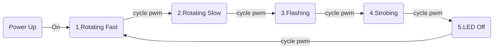

# pet_ros2_lightbeacon_pkg
ROS2 Python package to toggle PWM(RC) controlled light beacons on/off/strobe/blink.

This is the first "smoking/burning" release...

<table>
   <tr>
      <td>
        
      </td>
      <td>
        
      </td>
   </tr>
</table>

