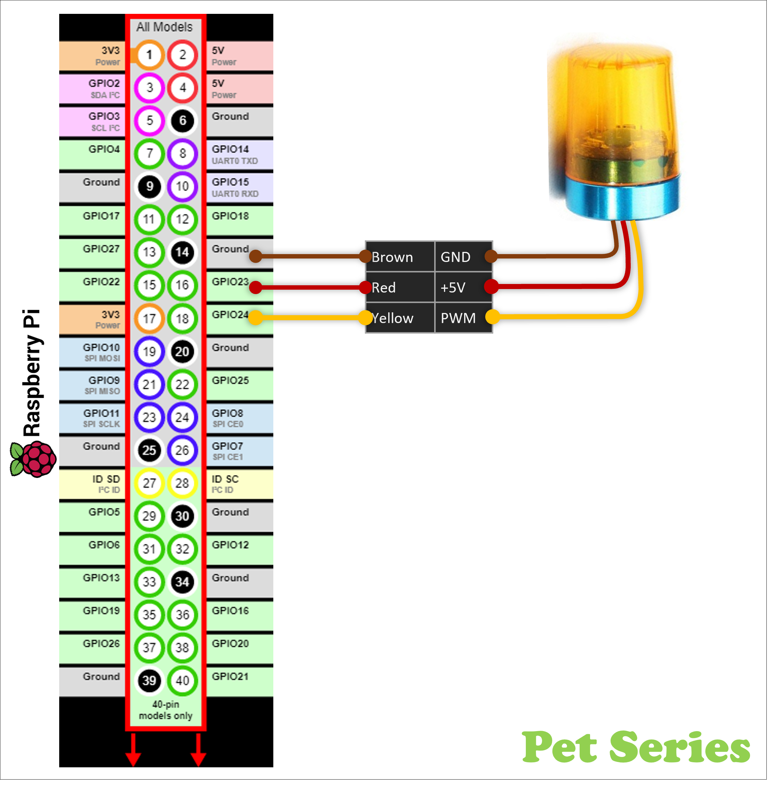

# ROS2 Python package to controll a 'Light Beacon'
Toggle light mode, by sending servo/PWM(RC) from the RPi GPIO-pins to the LED-Light Beacon.

This is the first "smoking/burning" release...

<table>
   <tr>
      <td>
        
      </td>
      <td>
        
      </td>
   </tr>
</table>


## ROS2 Package/Module Behaviour
1. Once: Power up + Toggle LightBeacon-mode to `LEDoff`
1. Once: Read/Set ROS2 Parameters for the module
1. Repeatedly: Subscripe on topic 
1. Repeatedly: Send needed number of PWM-cycles to toggle the Light Beacon to the requested Light-mode.

## Prerequisite: Software
* Ubuntu 20.04 (64bit) or newer
* Robot Operating System 2, ROS2 (Version Galathic)
  <blockquote>...do the ROS2-installation stuff...</blockquote>

## Prerequisite: Linux/Ubuntu vs. Software
`Ubuntu Shell`
```
 $ sudo apt install python3-pip
 $ sudo apt-get install python3-rpi.gpio
 $ sudo pip3 install gpiozero
```
<ul><blockquote>🚨TODO: When Ubuntu 22.04 LTS arrives. Update to newer lgpio <br>
</blockquote></ul>

## Prerequisite: Hardware
* Single Board Computer(SBC): Raspberry Pi 2/3/4
* RC Light Beacon - 3-wire (Same kind of connector/signal that trad. RC-servo uses)
<ul><blockquote>🌐Google tips to find/order light beacon from eBay/AliExpress/Wish/Amazon/...  <br>
1) "Remote control RC Car LED Rotating Beacon Light Flashing"<br>
2) "RC DIY LED Rotating Beacon Light Flashing for 1:14"
</blockquote></ul>
<table>
   <tr>
      <td>
        
      </td>
      <td>
        .
      </td>
   </tr>
</table>

## Dowload and install this ROS2 packages
Create a ROS2 workspace (in my exampel '~/ws_ros2/') \
Dowload ROS2 package by using 'git clone'
<ul><blockquote>🤔There is probably better tutorials how to do this...<br>
                ...but here is how I made it.
</blockquote></ul>

`Ubuntu Shell`
```
~$ mkdir -p ~/ws_ros2/src
~$ cd ~/ws_ros2/src
~/ws_ros2/src$ git clone https://github.com/Pet-Series/pet_ros2_lightbeacon_pkg.git
~/ws_ros2/src$ cd ..
~/ws_ros2$ colcon build --symlink-install
~/ws_ros2$ source /opt/ros/galactic/setup.bash
~/ws_ros2$ source ./install/setup.bash
```

## ROS2 Launch sequence
`Ubuntu Shell`
```
 $ ros2 run pet_ros2_lightbeacon_pkg pet_lightbeacon_node
  [INFO] [1646246566.984787281] [light_beacon_node]: light_beacon_node initiating
  [INFO] [1646246566.997037838] [light_beacon_node]: light_beacon_node has started
  [INFO] [1646246567.000520111] [light_beacon_node]: - beacon_power  GPIO-pin: 23
  [INFO] [1646246567.003899033] [light_beacon_node]: - beacon_signal GPIO-pin: 24
  [INFO] [1646246567.007907337] [light_beacon_node]: - beacon_mode  ROS Topic: beacon_mode
```

## ROS2 Topics used by this package
Manuover the light beacon from the command line by enter one of the following commands.
`Ubuntu Shell`
```
$  ros2 topic pub /beacon_mode std_msgs/msg/String "data: RotatingFast" -1
$  ros2 topic pub /beacon_mode std_msgs/msg/String "data: RotatingSlow" -1
$  ros2 topic pub /beacon_mode std_msgs/msg/String "data: Flashing" -1
$  ros2 topic pub /beacon_mode std_msgs/msg/String "data: Strobing" -1
$  ros2 topic pub /beacon_mode std_msgs/msg/String "data: LEDoff" -1
$  ros2 topic pub /beacon_mode std_msgs/msg/String "data: Reset" -1
```

## ROS2 Parameters used by this package
Save a "dump" of all the parameters that <code>light_beacon_node</code> uses.
`Ubuntu Shell`
```
$ ros2 param dump /light_beacon_node --print
  /light_beacon_node:
    ros__parameters:
      beacon_topic: beacon_mode
      gpio_pin_power: 23
      gpio_pin_signal: 24
$ 
```
```
$ ros2 param describe /light_beacon_node beacon_topic 
  Parameter name: beacon_topic
    Type: string
    Description: GPIO-pin for input/signal to toggle state [default <24>]
    Constraints:
$ 
```
```
$ ros2 param describe /light_beacon_node gpio_pin_signal 
Parameter name: gpio_pin_signal
  Type: integer
  Description: GPIO-pin for input/signal to toggle state [default <24>]
  Constraints:
$ 
```
```
$ ros2 param describe /light_beacon_node gpio_pin_power 
  Parameter name: gpio_pin_power
    Type: integer
    Description: GPIO-pin for ligh_beacon +3.3V-power [default <23>]
    Constraints:
$ 
```
